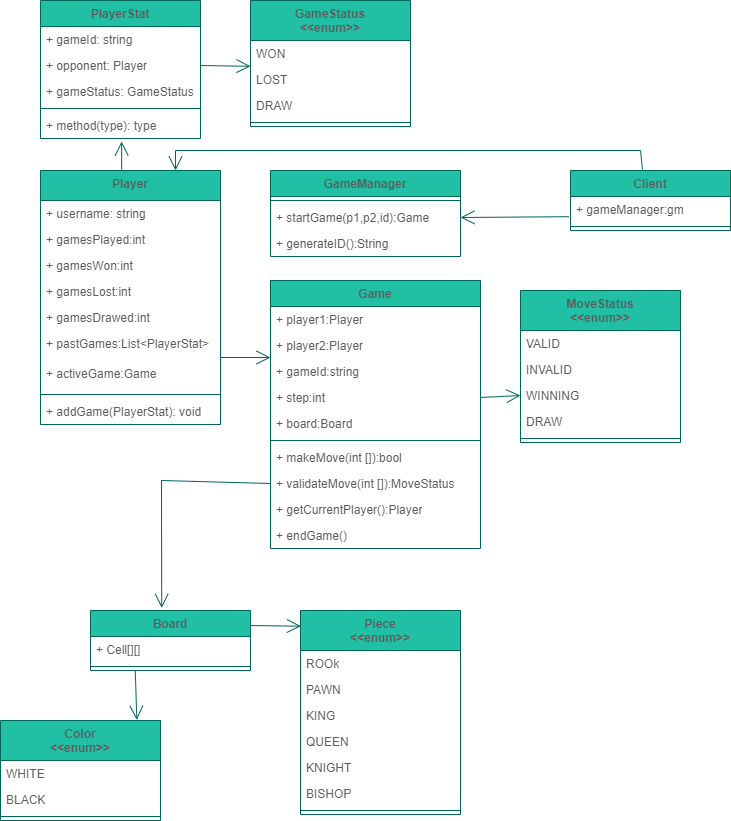

# LLD of Multiplayer Chess Platform

## Requirements
* one game can only be played between only 2 players
* each player can have at most 1 active game at a given time
* multiple games between different pairs of users can be played simultaneously
* players can see their stats and past games

## Class Diagram
